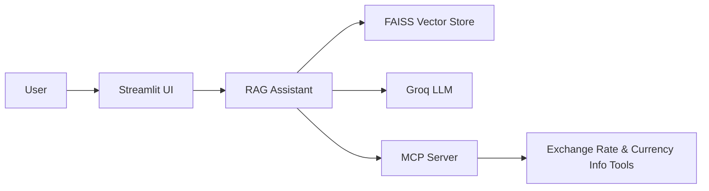

# 🤖 Product Support Assistant — RAG + MCP

<p align="center">
  
  
  
  
  
</p>

> A production-ready **product support assistant** that blends **RAG (Retrieval-Augmented Generation)** with **MCP tool calling** to deliver accurate, tool-backed answers in seconds.

## ⏱️ 1‑Minute Overview

- **RAG pipeline** indexes product FAQs (`data/faqs.txt`) with FAISS for fast retrieval.
- **MCP server** exposes external tools (currency exchange + currency info).
- **Groq LLM** composes final answers using retrieved context and tool results.
- **Streamlit UI** provides a polished chat experience with tool visibility.

## 📸 Demo

<p align="center">
  
</p>

[🎥 Watch Screen Recording](https://drive.google.com/uc?export=download&id=1isI8-JJaJhOP6olVCTyZ8yprL0bRS3i_)

## ✨ Key Features

- **RAG-based FAQ search** for accurate product answers
- **MCP tool integration** for live currency conversions
- **Streamlit chat UI** with status, metadata, and tool usage
- **Modular design** for easy extension (new tools, new knowledge bases)

## 🧱 Architecture



## 🚀 Quickstart

### Prerequisites

- Python **3.11+**
- Groq API key
- (Optional) MCP server running locally for real tool calls

### Setup

```bash
git clone https://github.com/ImaduddeenKhan/RAG-MCP-product-support-assistant.git
cd RAG-MCP-product-support-assistant

python -m venv venv
source venv/bin/activate  # Windows: .\venv\Scripts\Activate.ps1

pip install -r requirements.txt
```

### Environment Variables

Create a `.env` file in the repository root:

```bash
GROQ_API_KEY=your_api_key_here
MCP_SERVER_URL=http://localhost:8001
```

| Variable | Required | Default | Description |
| --- | --- | --- | --- |
| `GROQ_API_KEY` | ✅ | — | Groq API key for LLM inference |
| `MCP_SERVER_URL` | ❌ | `http://localhost:8001` | MCP server base URL |
| `MCP_TRANSPORT` | ❌ | `http` | Use `stdio` to run MCP in STDIO mode |

### Run

```bash
# Terminal 1: MCP server
python src/mcp_server.py

# Terminal 2: Streamlit UI
streamlit run src/app.py
```

Open: **http://localhost:8501**

## 🧪 Example Questions

**RAG (FAQ)**
- What are the pricing plans?
- How do I install TechFlow Pro Suite?
- What features are included?

**MCP Tools**
- Convert 50 USD to EUR
- What is the USD to INR exchange rate?
- Tell me about the Japanese Yen

## 🔌 MCP Tools

- `get_current_exchange_rate` → currency conversion
- `get_currency_info` → currency metadata (name, symbol, country)

## 🧰 Tech Stack

- **LangChain** (RAG + tool calling)
- **Groq** (LLM inference)
- **FAISS** (vector search)
- **FastAPI + FastMCP** (MCP server)
- **Streamlit** (chat UI)

## 📁 Project Structure

```
data/
  faqs.txt                # Product FAQs knowledge base
src/
  app.py                  # Streamlit UI
  rag_assistant.py        # RAG + tool calling orchestration
  mcp_server.py           # MCP tool server (FastAPI)
requirements.txt
```

## 🤝 Contributing

Pull requests are welcome. For major changes, open an issue first to discuss what you’d like to improve.
